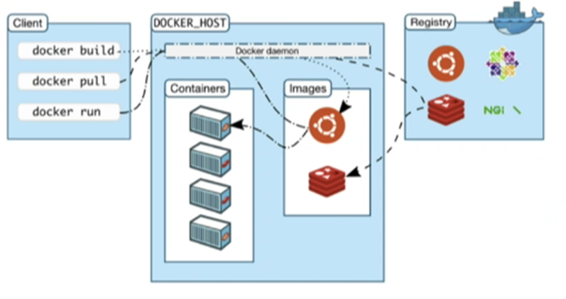
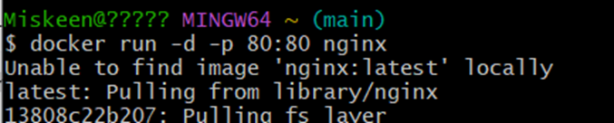
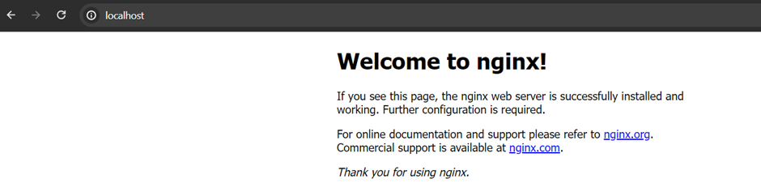
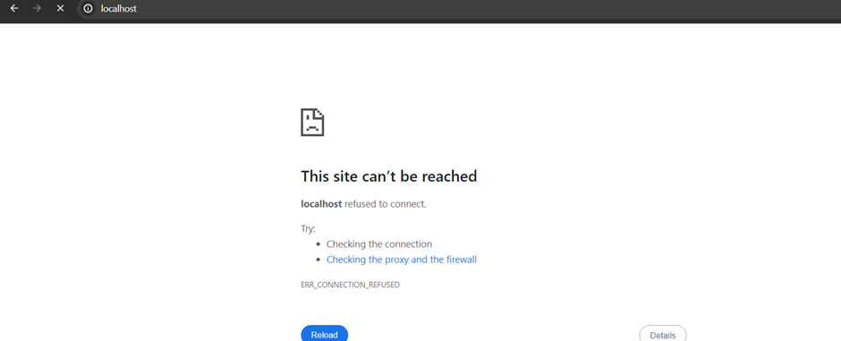
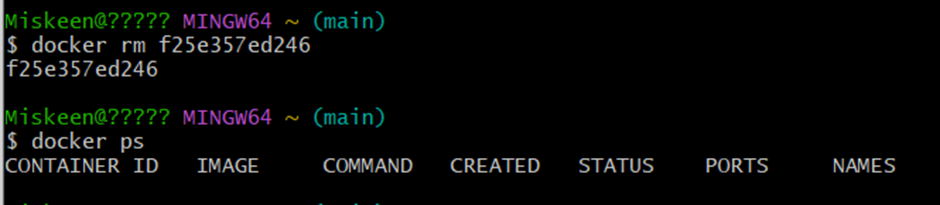
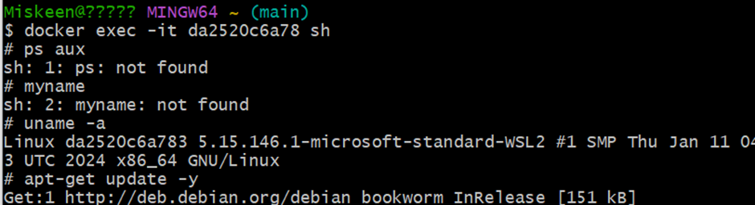
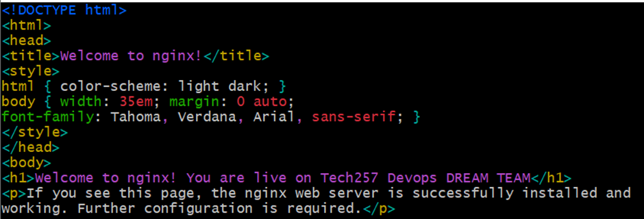
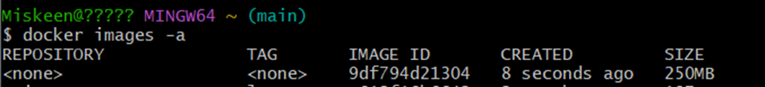
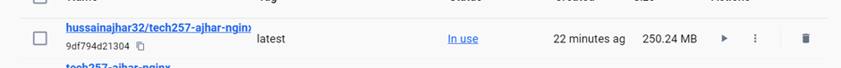

# Docker Basics

Docker utilizes APIs in the background to containerize applications, providing a lightweight alternative to virtual machines.

- **Building Docker Images**:
  - Use `docker build` command to create a Docker image.

- **Running Containers**:
  - Execute `docker run <image>` command to run a Docker container. If the image is not found locally, Docker will pull it from Docker Hub.
   

- **Checking Status**:
  - Verify if the container is running on localhost:80.
   

- **Stopping Containers**:
  - Stop a running container using `docker stop <id>` command.
   
  - We can see container is no longer running on localhost:80
   

- **Removing Containers**:
  - Remove a container with `docker rm <instance_id>` command.
   

- **Windows Specifics**:
  - For Windows, use `alias docker="winpty docker"` to interact with Docker instances. Execute `docker exec -it <instance_id> sh` to access a container.
   

- **Live Changes**:
  - Make changes to index.html file and observe if they are reflected live in production as the container is running.
  - In index.html:
   
  - Click refresh on localhost:
   

- **Creating and Pushing Images**:
  - Use `docker commit <container_id>` to create an image of a container.
  - Use `docker images -a` to find the image.
   
  - Tag the image locally with `docker tag <image_id> <local_tag>` and then tag it for Docker Hub with `docker tag <local_tag> <dockerhub_username>/<repo_name>`.
  - Push the image to Docker Hub using `docker push <dockerhub_username>/<repo_name>`. Verify its presence on Docker Hub.
   

- **Running Container from Image**:
  - Run a container from the Docker image
  
  - Confirm its functionality.
   

