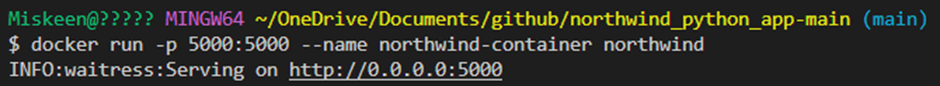

# Docker Basics

Docker utilizes APIs in the background to containerize applications, providing a lightweight alternative to virtual machines.


- **Building Docker Images**:
  - Use `docker build` command to create a Docker image.

- **Running Containers**:
  - Use the `docker run <image>` command to run a Docker container. If the image is not found locally, Docker will pull it from Docker Hub.
   

- **Checking Status**:
  - Verify if the container is running on localhost:80.
   

- **Stopping Containers**:
  - Stop a running container using `docker stop <id>` command.
   
  - We can see container is no longer running on localhost:80
   

- **Removing Containers**:
  - Remove a container with `docker rm <instance_id>` command.
   

- **Windows Specifics**:
  - For Windows, use `alias docker="winpty docker"` to interact with Docker instances. Execute `docker exec -it <instance_id> sh` to access a container.
   

- **Live Changes**:
  - Make changes to index.html file and observe if they are reflected live in production as the container is running.
  - In index.html:
   
  - Click refresh on localhost:
   

- **Creating and Pushing Images**:
  - Use `docker commit <container_id>` to create an image of a container.
  - Use `docker images -a` to find the image.
   
  - Tag the image locally with `docker tag <image_id> <local_tag>` and then tag it for Docker Hub with `docker tag <local_tag> <dockerhub_username>/<repo_name>`.
  - Push the image to Docker Hub using `docker push <dockerhub_username>/<repo_name>`. Verify its presence on Docker Hub.
   

- **Running Container from Image**:
  - Run a container from the Docker image
  
  - Confirm its functionality.
   

## Containerizing the Northwind Application

Useful links: [How to Dockerize a Flask App](https://www.freecodecamp.org/news/how-to-dockerize-a-flask-app/)

1. **Create a dockerfile:**
```bash
# syntax=docker/dockerfile:1

# Use an official Python runtime as a parent image
FROM python:3.9-slim
 
# Set the working directory in the container
WORKDIR /app
 
# Copy the current directory contents into the container at /app
COPY . /app
 
# Install any needed packages specified in requirements.txt
RUN pip install --no-cache-dir -r requirements.txt
 
# Make port 5000 available to the world outside this container
EXPOSE 5000

# Define environment variable
ENV FLASK_APP=northwind_web.py
 
# Run app.py when the container launches
CMD ["waitress-serve", "--port=5000", "northwind_web:app"]
```

2. **Build Image:**
Build the image with docker build -t northwind .


3. **Run Container:**
Execute docker run -p 5000:5000 --name northwind-container northwind

4. **Confirm:**
Confirm the application is running on localhost.
